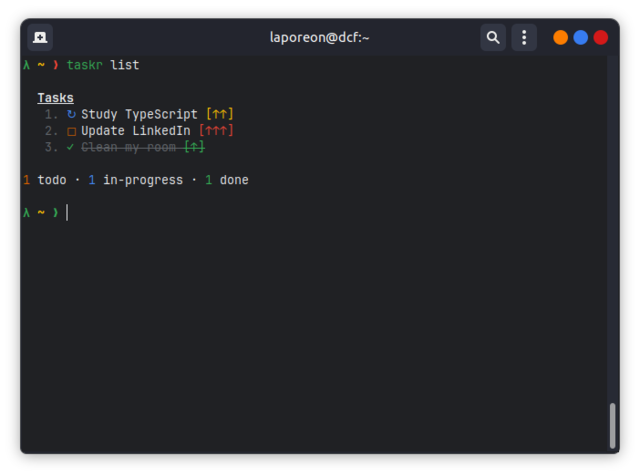

<h1 align="center"> 📝 Taskr


[](https://eslint.org/)
[](https://github.com/laporeon/taskr/blob/main/LICENSE)

</h1>

> A task tracker CLI.

## Table of Contents

- [Features](#Features)
- [Requirements](#Requirements)
- [Installing](#installing)
- [Usage](#usage)
- [Preview](#preview)
  <br/>

---

## Features

- ✔️ Create a new task. Optionally, you can set a priority status. Default will be "low".
- ✔️ List all tasks or list tasks by current status.
- ✔️ Update task title, status or priority. Also possible to update all these fields at th same time.
- ✔️ Remove a task.

## Requirements

- [NodeJS](https://nodejs.org/en) v.22 or higher

If you use [NVM](https://github.com/nvm-sh/nvm), just run `nvm use` inside of the root folder.

## Installing

After cloning this repository, you'll need to build the project to compile files.

Run the following command inside the root folder to compile project:

```bash
$ npm run build
```

Yet on the root folder, run the following command to install the project globally on your machine and allow you to use it at any directory you are.

```bash
$ npm install -g .
```

Now you're good to go.

## Usage

```text
Usage: taskr [options] [command]

A task tracker CLI.

Options:
  -V, --version              output the version number
  -h, --help                 display help for command

Commands:
  add [options] <title>  Add a new task.
  list [options]         List all tasks or list tasks by status.
  update [options] <id>  Update task title, status or priority. You can also update all at once.
  remove <id>            Delete a task.
  help [command]         display help for command

Examples:
  $ taskr add "Clean node_modules"
  $ taskr add "Study" -p high
  $ taskr list
  $ taskr list -s "todo"
  $ taskr update 5 -t "New Task Title"
  $ taskr update 5 -p "high"
  $ taskr update 5 -s "in-progress"
  $ taskr update 5 -t "New Task Title -p "medium" -s "done"
  $ taskr remove 2
```

## Preview



[⬆ Back to the top](#--taskr)
