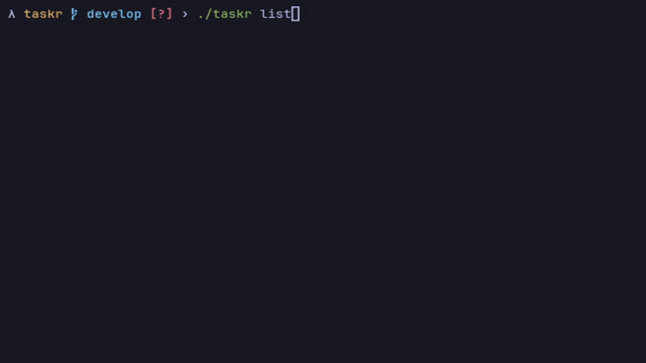

<h1 align="center"> Taskr


[](https://github.com/laporeon/taskr/blob/main/LICENSE)

</h1>

## Table of Contents

- [About](#about)
- [Requirements](#requirements)
- [Getting Started](#getting-started)
- [Usage](#usage)
- [Preview](#preview)

## About

Taskr is a Java-based CLI to easily manage your tasks through your terminal.

**Key features:**

- Persists tasks locally in a simple `tasks.txt` file.
- Validates status and priority against defined patterns.
- Full CRUD operations for tasks.
- Generates UUID-based IDs to avoid collisions in the local file.
- Uses 1-based indexing for list and delete commands to improve usability.

## Requirements

- Java 21+
- Maven 3.9+

## Getting Started

**1. Build**

```bash
mvn clean package
```

This will create an executable JAR at `target/taskr.jar`.

**2. Run**

Pick the option that fits your workflow:

**Option 1 — Direct JAR execution**

```bash
# Linux / macOS
java -jar target/taskr.jar [command] [options]
 
# Windows
java -jar target\taskr.jar [command] [options]
```

**Option 2 — Wrapper script**

```bash
# Linux / macOS 
chmod +x taskr # (first time only: make it executable)
./taskr [command] [options]
 
# Windows
taskr.bat [command] [options]
```

**Option 3 — System-wide alias (run `taskr` from anywhere)**

Linux / macOS — add to your `.bashrc` or `.zshrc`:

```bash
alias taskr='java -jar /full/path/to/taskr/target/taskr.jar'
```

Then reload your profile:

```bash
source ~/.bashrc   # or source ~/.zshrc
```

Windows — add to your PowerShell profile (`$PROFILE`):

```powershell
function taskr { java -jar "C:\full\path\to\taskr\target\taskr.jar" @args }
```

Then reload:

```powershell
. $PROFILE
```

## Usage

Quick reference. For full details, run `taskr --help`.

```text
Usage: taskr [command] [options]

Commands:
  add <title> [options]         Create a new task.
  list [options]                List all tasks or list tasks by status.
  update <index> [options]      Update task title, status and/or priority.
  delete <index> [options]      Delete a task.

Examples:
  $ taskr add "Clean node_modules"
  $ taskr add "Study Java" -p "high"
  $ taskr list
  $ taskr list -s "todo"
  $ taskr update 2 -t "New Task Title"
  $ taskr update 3 -p "high"
  $ taskr update 4 -s "in-progress"
  $ taskr update 5 -t "New Task Title" -p "medium" -s "in-progress"
  $ taskr delete 6
```

## Preview



[⬆ Back to the top](#-taskr)
